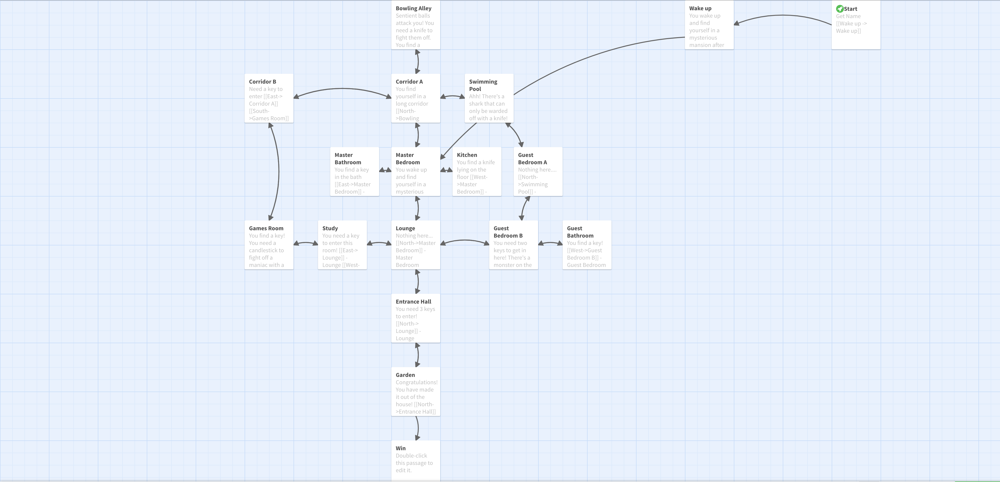

# Money Run!

This is my HUGE Replit Kajam 2021 entry! - https://replit.com/site/kajam

## Creating Money Run!

I decided to create a text-based adventure game, because they aren't that common anymore, and they're really fun. *And retro*.

Next, I came up with the idea. I've not done an RPG for a long time, so I decided to challenge myself with it!

Then, I came up with a floor plan for the "mansion" I was using.

Next, I opened Twine and created a flow chart.

Twine allows you to export your flowcharts as a HTML file that you can "play".

I've put these in a seperate repl here: https://Twine-Money-Run.dillonb07.repl.co

Then, it was time to make it!

*A sequel might come out soon......*

